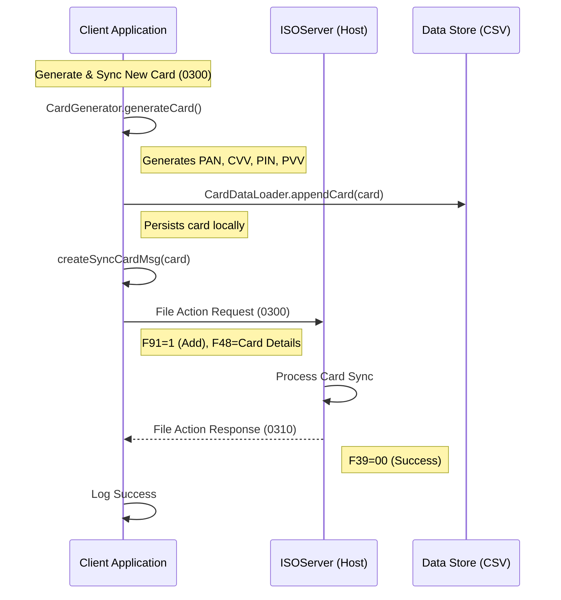
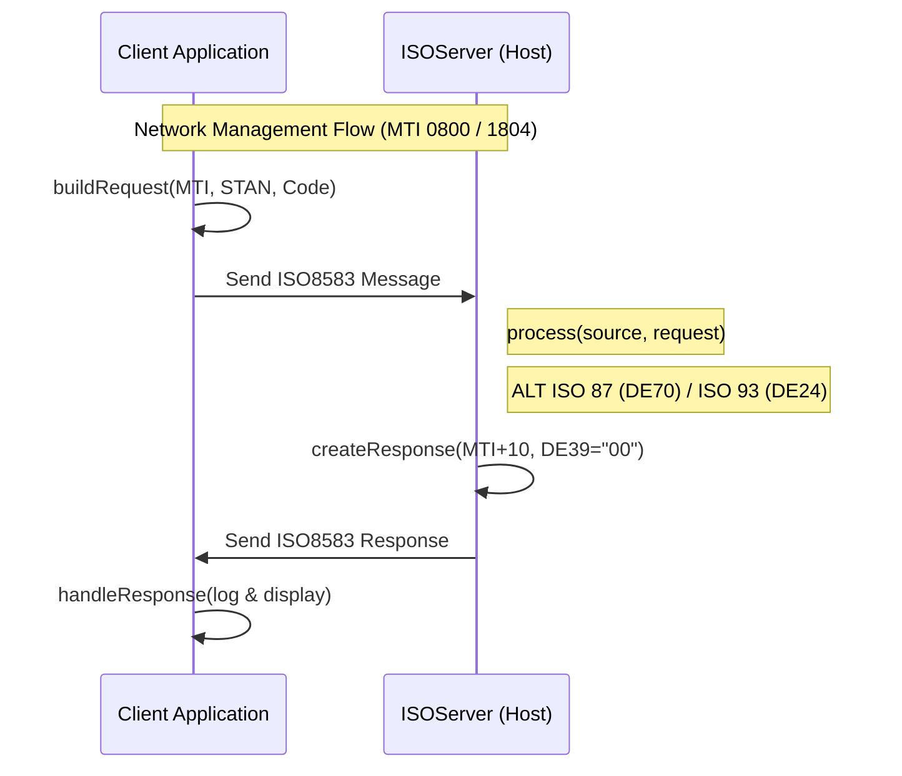
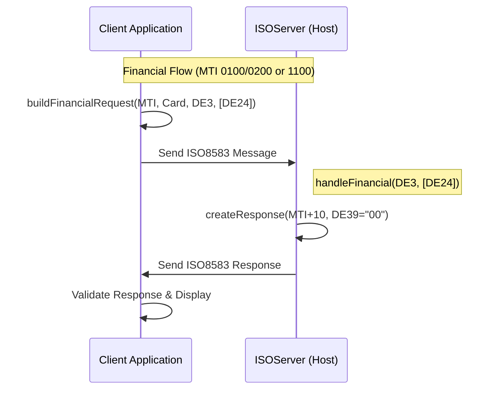
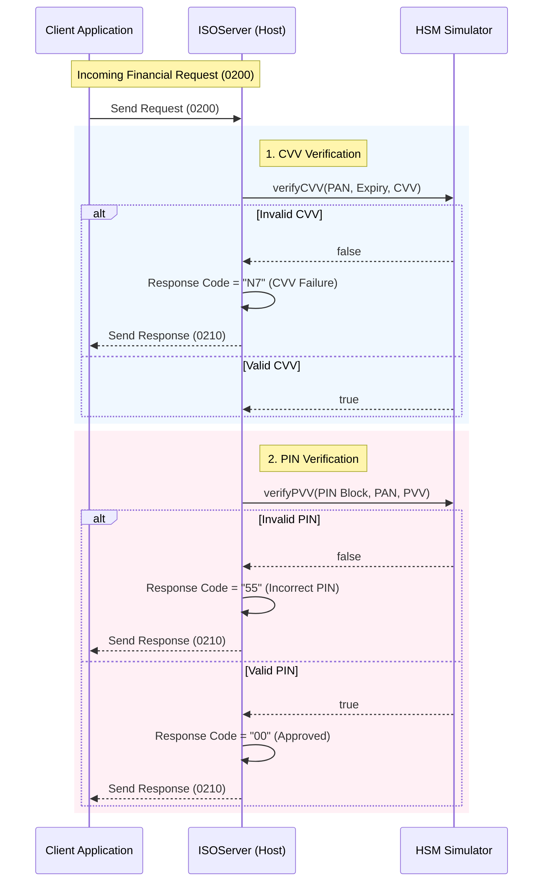
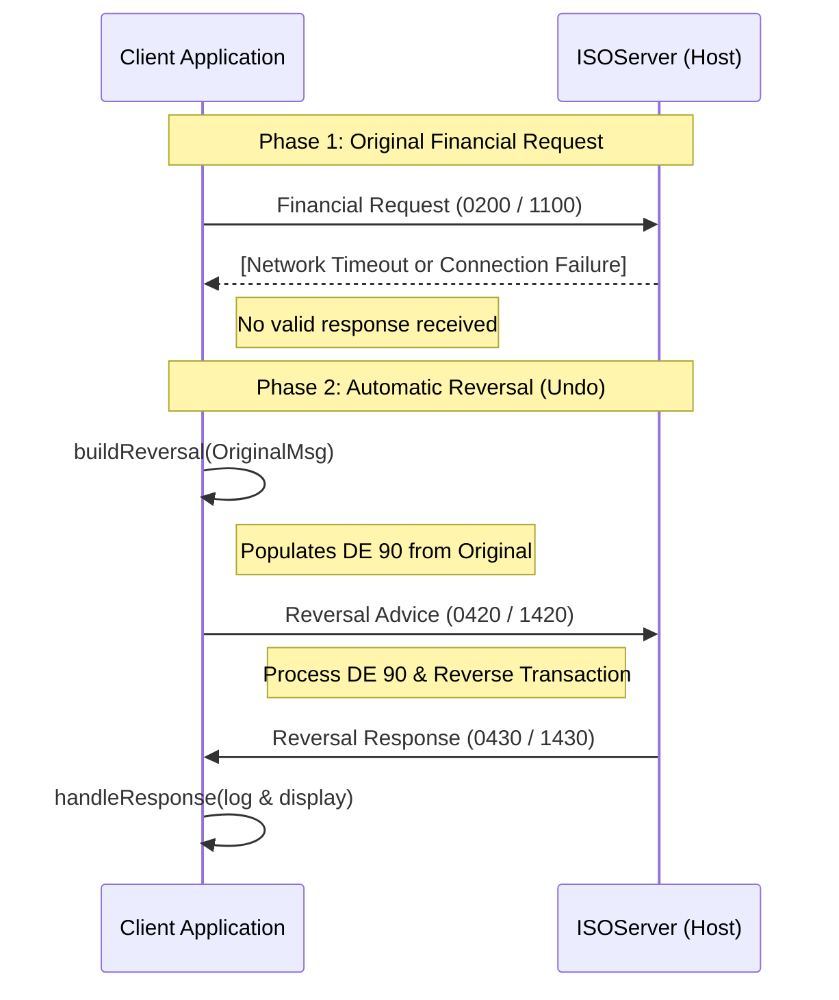

# JPOS Simulator - Technical Walkthrough

This guide provides technical details on the simulator's architecture, including the recent logging refactor, automated testing lifecycle, and transaction flow diagrams.

---

## 🏗️ Technical Architecture & Refactoring

I have refactored the logging mechanism in both **ISO87** and **ISO93** suites to align with jPOS's built-in logging capabilities. This ensures consistency between client and server logs.

### Key Changes
- **Built-in Logging**: The simulator uses the built-in jPOS logging ( `Logger` and `FileLogListener` ) framework for both Client and Server, ensuring structured XML logs for all transactions.
- **File Persistence**: Logs are now automatically persisted to the `log/` directory:
  - `ISO87CLIENT.log` / `ISO87HOST.log`
  - `ISO93CLIENT.log` / `ISO93HOST.log`
- **Automated Lifecycle**: Integration tests automatically manage the server lifecycle. The test suite checks for port availability and starts/stops the server as needed.

---
## 🚀 Scenario-Based Testing

### 🔄 Transaction Flow: Generate & Sync New Card

This flow demonstrates the client's ability to generate a new card number, perform local validation, and synchronize it with the host.



#### Process Steps

1.  **Card Generation**:
    - The client generates a valid **PAN** (with Luhn check), **CVV**, and **PIN/PVV** using `CardGenerator`.
    - Default Prefix: `453211` (VISA).

2.  **Local Persistence**:
    - The new card is immediately saved to `cards.csv` so it can be used for subsequent transactions.

3.  **Host Synchronization**:
    - An **File Action Message (0300)** is sent to the host.
    - **Field 91**: `1` (File Update / Add).
    - **Field 48**: Contains encoded card details (Scheme, Limits, BIN).

#### Request message
**File Action (Generate & Sync) Request (0300)**
```xml
<log realm="iso87-client-channel" at="2026-02-09T10:21:18.209186500">
  <send>
    <isomsg direction="outgoing">
      <!-- org.jpos.iso.packager.GenericPackager -->
      <field id="0" value="0300"/>
      <field id="2" value="4532119293991466"/>
      <field id="7" value="0209102118"/>
      <field id="11" value="668689"/>
      <field id="14" value="2912"/>
      <field id="41" value="GEN_SRC"/>
      <field id="48" value="SCHEME=VISA|LIMIT_TXN=2000.00|LIMIT_DAILY=10000.00|BIN=453211"/>
      <field id="91" value="1"/>
      <field id="101" value="CARD_MASTER"/>
    </isomsg>
  </send>
</log>
```

#### Response message
**File Action (Generate & Sync) Response (0310)**
```xml
<log realm="iso87-client-channel" at="2026-02-09T10:21:18.212368100">
  <receive>
    <isomsg direction="incoming">
      <!-- org.jpos.iso.packager.GenericPackager -->
      <field id="0" value="0310"/>
      <field id="7" value="0209102118"/>
      <field id="11" value="668689"/>
      <field id="39" value="00"/>
      <field id="41" value="GEN_SRC "/>
      <field id="91" value="1"/>
      <field id="101" value="CARD_MASTER"/>
    </isomsg>
  </receive>
</log>
```

---

### 🔄 Transaction Flow: Network Management

The following diagram illustrates the end-to-end communication flow for Network Management transactions (Echo, Logon, Logoff, Key Exchange) between the Client and Server.



#### Protocol Mapping (Net Mgmt)

| Protocol | Request MTI | Response MTI | Action Field | Field Reference |
| :--- | :--- | :--- | :--- | :--- |
| **ISO 87** | `0800` | `0810` | DE 70 | 301 (Echo), 001 (Logon), etc. |
| **ISO 93** | `1804` | `1814` | DE 24 | 801 (Echo), 001 (Logon), etc. |

#### Request message
**Network Management (Echo) Request (0800)**
```xml
<log realm="iso87-client-channel" at="2026-02-08T22:56:08.277035300">
  <send>
    <isomsg direction="outgoing">
      <!-- org.jpos.iso.packager.GenericPackager -->
      <field id="0" value="0800"/>
      <field id="7" value="0208225608"/>
      <field id="11" value="004793"/>
      <field id="70" value="301"/>
    </isomsg>
  </send>
</log>
```

#### Response message
**Network Management (Echo) Response (0810)**
```xml
<log realm="iso87-client-channel" at="2026-02-08T22:56:08.278035900">
  <receive>
    <isomsg direction="incoming">
      <!-- org.jpos.iso.packager.GenericPackager -->
      <field id="0" value="0810"/>
      <field id="7" value="0208225608"/>
      <field id="11" value="004793"/>
      <field id="39" value="00"/>
      <field id="70" value="301"/>
    </isomsg>
  </receive>
</log>
```

### 🔄 Transaction Flow: Financial Transactions

Financial transactions handle authorization and funds movement (Purchase, Withdrawal, Refund, etc.). Unlike Network Management, these check the **Processing Code (DE 3)** and **Function Code (DE 24)** for routing.



#### Protocol Mapping (Financial)

| Transaction | Protocol | Request MTI | Proc Code (DE 3) | Func Code (DE 24) |
| :--- | :--- | :--- | :--- | :--- |
| **Purchase** | ISO 87 | `0200` | `000000` | N/A |
| **Purchase** | ISO 93 | `1100` | `000000` | `100` |
| **Withdrawal**| ISO 87 | `0200` | `010000` | N/A |
| **Withdrawal**| ISO 93 | `1100` | `010000` | `100` |

#### Request message
**Financial (Purchase) Request (0200)**
```xml
<log realm="iso87-client-channel" at="2026-02-08T22:56:46.931879800">
  <send>
    <isomsg direction="outgoing">
      <!-- org.jpos.iso.packager.GenericPackager -->
      <field id="0" value="0200"/>
      <field id="2" value="5412340358517705"/>
      <field id="3" value="000000"/>
      <field id="4" value="000000001000"/>
      <field id="7" value="0208225646"/>
      <field id="11" value="134932"/>
      <field id="12" value="225646"/>
      <field id="13" value="0208"/>
      <field id="14" value="2912"/>
      <field id="18" value="5999"/>
      <field id="22" value="021"/>
      <field id="25" value="00"/>
      <field id="32" value="123456"/>
      <field id="37" value="039221349321"/>
      <field id="41" value="TERM0001"/>
      <field id="42" value="MERCHANT0000001"/>
      <field id="44" value="8422"/>
      <field id="48" value="CVV=998"/>
      <field id="49" value="840"/>
      <field id="52" value="049244BFCA7AE88F" type="binary"/>
    </isomsg>
  </send>
</log>
```

#### Response message
**Financial (Purchase) Response (0210)**
```xml
<log realm="iso87-client-channel" at="2026-02-08T22:56:46.934886800">
  <receive>
    <isomsg direction="incoming">
      <!-- org.jpos.iso.packager.GenericPackager -->
      <field id="0" value="0210"/>
      <field id="7" value="0208225646"/>
      <field id="11" value="134932"/>
      <field id="37" value="039221349321"/>
      <field id="38" value="611753"/>
      <field id="39" value="00"/>
      <field id="41" value="TERM0001"/>
      <field id="42" value="MERCHANT0000001"/>
      <field id="49" value="840"/>
    </isomsg>
  </receive>
</log>
```

### 🔒 Transaction Flow: Card & PIN Verification

For financial interactions, the server performs security checks before authorizing the transaction. This includes **CVV Verification** and **PIN Verification**.



#### Verification Logic

1.  **CVV Check (Card Verification)**:
    - Extracts `CVV` from **Field 48**.
    - validates it against the PAN and Expiry using the HSM.
    - **Failure**: Returns Response Code `N7`.

2.  **PIN Check**:
    - Requires **Field 52** (PIN Block) and **Field 44** (PVV).
    - The HSM validates the Encrypted PIN Block against the PVV.
    - **Failure**: Returns Response Code `55`.

---

### Transaction Flow: Reversal Messages

Reversals are sent to undo a previous transaction that timed out or failed partially. They rely on **Original Data Elements (DE 90)** to link to the original transaction.



#### Protocol Mapping (Reversal)

| Protocol | Request MTI | Response MTI | Key Field | Contents |
| :--- | :--- | :--- | :--- | :--- |
| **ISO 87** | `0420` | `0430` | DE 90 | MTI, STAN, Date, Acq ID, Forward ID |
| **ISO 93** | `1420` | `1430` | DE 90 | MTI, STAN, Date, Acq ID, Forward ID |

### Request message
**Reversal (Purchase Reversal) Request**

#### ISO 87 (0420)
```xml
<log realm="iso87-client-channel" at="2026-02-09T12:00:14.185490900">
  <send>
    <isomsg direction="outgoing">
      <!-- org.jpos.iso.packager.GenericPackager -->
      <field id="0" value="0420"/>
      <field id="2" value="5412340358517705"/>
      <field id="3" value="000000"/>
      <field id="4" value="000000001000"/>
      <field id="7" value="0209120014"/>
      <field id="11" value="713978"/>
      <field id="12" value="120014"/>
      <field id="13" value="0209"/>
      <field id="22" value="021"/>
      <field id="25" value="00"/>
      <field id="37" value="040122813921"/>
      <field id="38" value="881528"/>
      <field id="41" value="TERM0001"/>
      <field id="42" value="MERCHANT0000001"/>
      <field id="49" value="840"/>
      <field id="90" value="020028139202091200141234560000000000000000"/>
    </isomsg>
  </send>
</log>
```

#### ISO 93 (1420)
```xml
<log realm="iso93-client-channel" at="2026-02-09T12:01:47.994869500">
  <send>
    <isomsg direction="outgoing">
      <!-- org.jpos.iso.packager.GenericPackager -->
      <field id="0" value="1420"/>
      <field id="2" value="5412340358517705"/>
      <field id="3" value="000000"/>
      <field id="4" value="000000001000"/>
      <field id="7" value="0209120147"/>
      <field id="11" value="167690"/>
      <field id="12" value="120147"/>
      <field id="13" value="0209"/>
      <field id="22" value="021"/>
      <field id="24" value="400"/>
      <field id="25" value="00"/>
      <field id="37" value="040124931331"/>
      <field id="38" value="074343"/>
      <field id="41" value="TERM0001"/>
      <field id="42" value="MERCHANT0000001"/>
      <field id="49" value="840"/>
      <field id="90" value="110049313302091201471234560000000000000000"/>
    </isomsg>
  </send>
</log>
```

#### Response message
**Reversal (Purchase Reversal) Response**

#### ISO 87 (0430)
```xml
<log realm="iso87-client-channel" at="2026-02-09T12:00:14.188568300">
  <receive>
    <isomsg direction="incoming">
      <!-- org.jpos.iso.packager.GenericPackager -->
      <field id="0" value="0430"/>
      <field id="3" value="000000"/>
      <field id="4" value="000000001000"/>
      <field id="7" value="0209120014"/>
      <field id="11" value="713978"/>
      <field id="37" value="040122813921"/>
      <field id="39" value="00"/>
      <field id="41" value="TERM0001"/>
      <field id="42" value="MERCHANT0000001"/>
      <field id="49" value="840"/>
    </isomsg>
  </receive>
</log>
```

#### ISO 93 (1430)
```xml
<log realm="iso93-client-channel" at="2026-02-09T12:01:47.998249600">
  <receive>
    <isomsg direction="incoming">
      <!-- org.jpos.iso.packager.GenericPackager -->
      <field id="0" value="1430"/>
      <field id="3" value="000000"/>
      <field id="4" value="000000001000"/>
      <field id="7" value="0209120147"/>
      <field id="11" value="167690"/>
      <field id="24" value="400"/>
      <field id="37" value="040124931331"/>
      <field id="39" value="00"/>
      <field id="41" value="TERM0001"/>
      <field id="42" value="MERCHANT0000001"/>
      <field id="49" value="840"/>
    </isomsg>
  </receive>
</log>
```

#### Log File Persistence
- Client logs are persisted to `log/ISO87CLIENT.log` and `log/ISO93CLIENT.log`.
- Logs are successfully persisted to `log/ISO87HOST.log` and `log/ISO93HOST.log` as well, capturing the server-side processing.

---

For detailed field specifications and build instructions, see the **[README.md](README.md)**.
