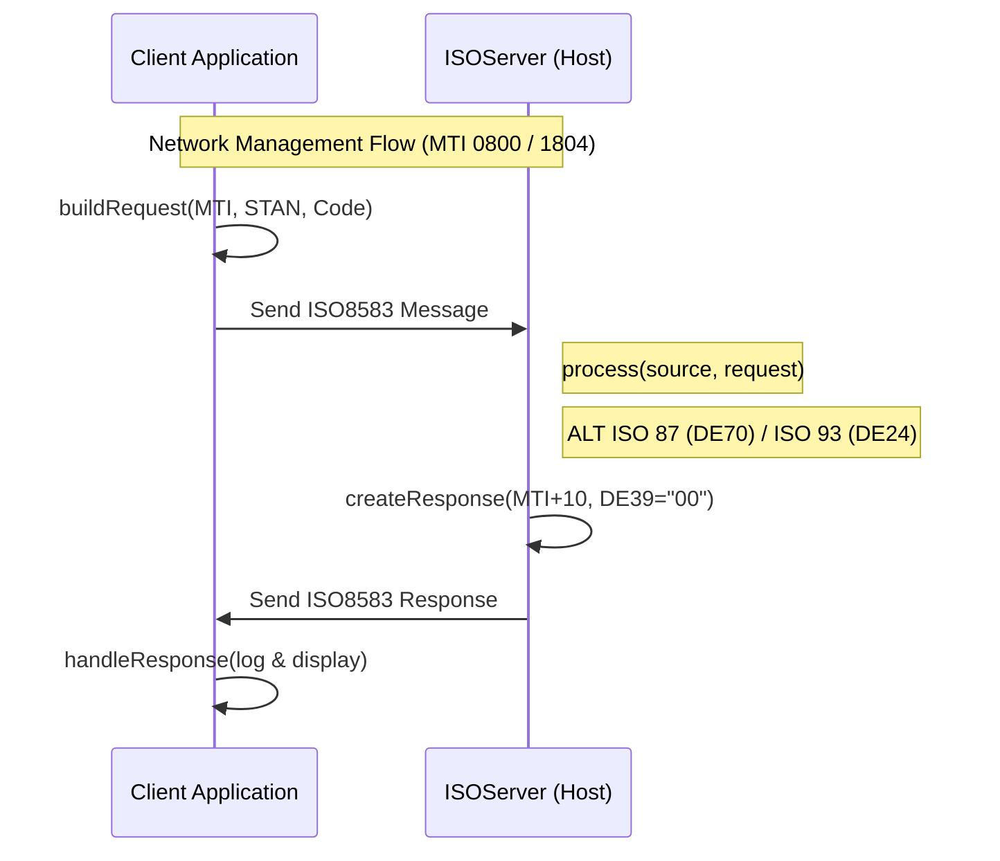
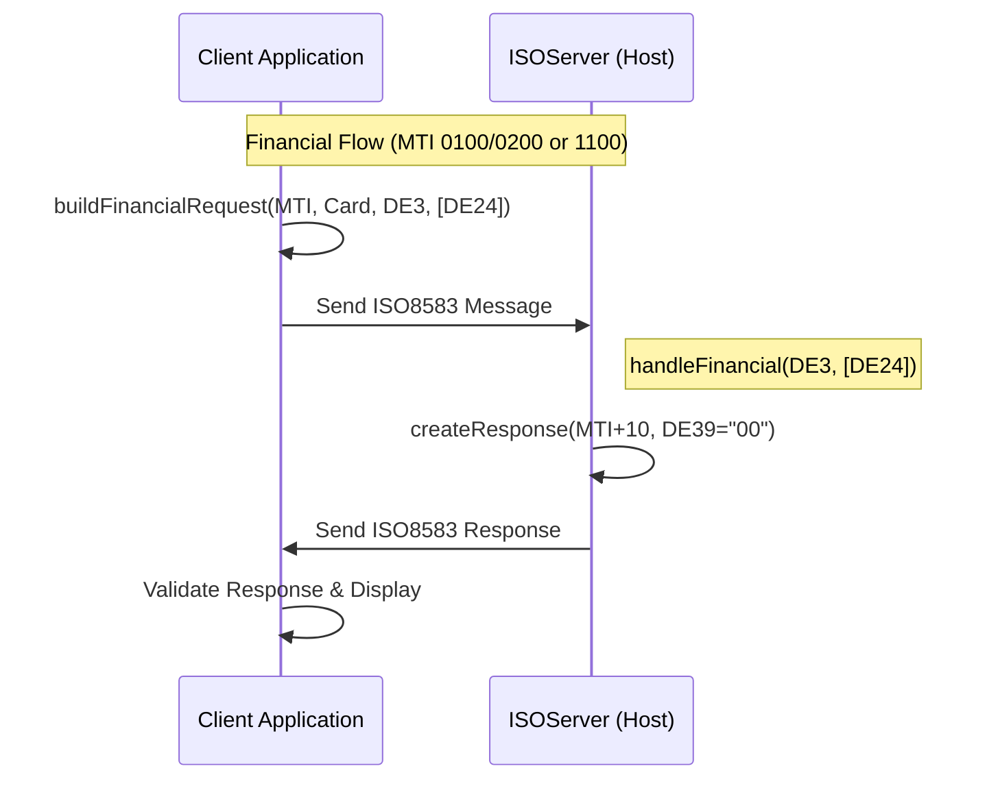
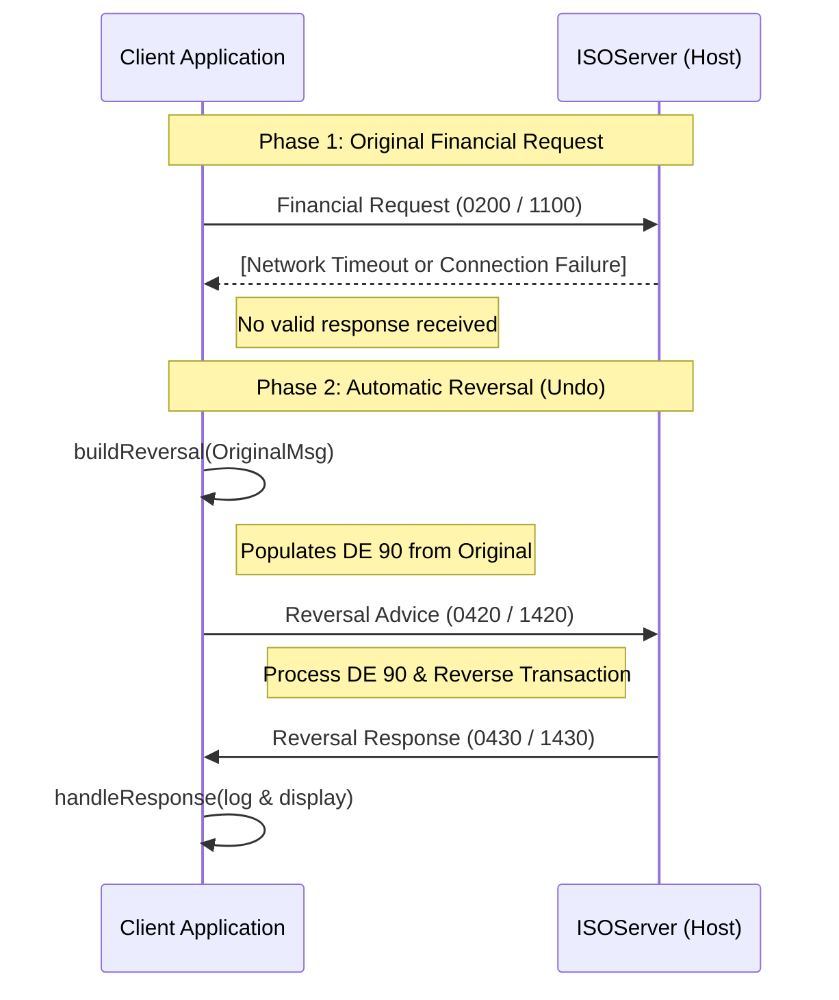

# JPOS Simulator - Technical Walkthrough

This guide provides technical details on the simulator's architecture, including the recent logging refactor, automated testing lifecycle, and transaction flow diagrams.

---

## 🏗️ Technical Architecture & Refactoring

I have refactored the logging mechanism in both **ISO87** and **ISO93** suites to align with jPOS's built-in logging capabilities. This ensures consistency between client and server logs.

### Key Changes
- **Built-in Logging**: The simulator uses the built-in jPOS logging ( `Logger` and `FileLogListener` ) framework for both Client and Server, ensuring structured XML logs for all transactions.
- **File Persistence**: Logs are now automatically persisted to the `log/` directory:
  - `ISO87CLIENT.log` / `ISO87HOST.log`
  - `ISO93CLIENT.log` / `ISO93HOST.log`
- **Automated Lifecycle**: Integration tests automatically manage the server lifecycle. The test suite checks for port availability and starts/stops the server as needed.

---

## 🔄 Transaction Flow: Network Management

The following diagram illustrates the end-to-end communication flow for Network Management transactions (Echo, Logon, Logoff, Key Exchange) between the Client and Server.



### Protocol Mapping (Net Mgmt)

| Protocol | Request MTI | Response MTI | Action Field | Field Reference |
| :--- | :--- | :--- | :--- | :--- |
| **ISO 87** | `0800` | `0810` | DE 70 | 301 (Echo), 001 (Logon), etc. |
| **ISO 93** | `1804` | `1814` | DE 24 | 801 (Echo), 001 (Logon), etc. |

## Transaction Flow: Financial Transactions

Financial transactions handle authorization and funds movement (Purchase, Withdrawal, Refund, etc.). Unlike Network Management, these check the **Processing Code (DE 3)** and **Function Code (DE 24)** for routing.



### Protocol Mapping (Financial)

| Transaction | Protocol | Request MTI | Proc Code (DE 3) | Func Code (DE 24) |
| :--- | :--- | :--- | :--- | :--- |
| **Purchase** | ISO 87 | `0200` | `000000` | N/A |
| **Purchase** | ISO 93 | `1100` | `000000` | `100` |
| **Withdrawal**| ISO 87 | `0200` | `010000` | N/A |
| **Withdrawal**| ISO 93 | `1100` | `010000` | `100` |

---

## Transaction Flow: Reversal Messages

Reversals are sent to undo a previous transaction that timed out or failed partially. They rely on **Original Data Elements (DE 90)** to link to the original transaction.



### Protocol Mapping (Reversal)

| Protocol | Request MTI | Response MTI | Key Field | Contents |
| :--- | :--- | :--- | :--- | :--- |
| **ISO 87** | `0420` | `0430` | DE 90 | MTI, STAN, Date, Acq ID, Forward ID |
| **ISO 93** | `1420` | `1430` | DE 90 | MTI, STAN, Date, Acq ID, Forward ID |

---

---

## 🧪 Verification & Logging Examples (Client)

The following carousel displays real-world jPOS XML logs captured during transaction execution. Use these examples to verify your implementation.

````carousel
### 1. Network Management (Echo)
**Request (0800)**
```xml
<log realm="iso87-client-channel" at="2026-02-08T11:28:29.892543400">
  <send>
    <isomsg direction="outgoing">
      <!-- org.jpos.iso.packager.GenericPackager -->
      <field id="0" value="0800"/>
      <field id="7" value="0208112829"/>
      <field id="11" value="013204"/>
      <field id="70" value="301"/>
    </isomsg>
  </send>
</log>
```
**Response (0810)**
```xml
<log realm="iso87-client-channel" at="2026-02-08T11:28:29.893108400">
  <receive>
    <isomsg direction="incoming">
      <!-- org.jpos.iso.packager.GenericPackager -->
      <field id="0" value="0810"/>
      <field id="7" value="0208112829"/>
      <field id="11" value="013204"/>
      <field id="39" value="00"/>
      <field id="70" value="301"/>
    </isomsg>
  </receive>
</log>
```
<!-- slide -->
### 2. Financial (Purchase)
**Request (0200)**
```xml
<log realm="iso87-client-channel" at="2026-02-08T11:28:29.862661100">
  <send>
    <isomsg direction="outgoing">
      <!-- org.jpos.iso.packager.GenericPackager -->
      <field id="0" value="0200"/>
      <field id="2" value="4532111084873030"/>
      <field id="3" value="000000"/>
      <field id="4" value="000000001000"/>
      <field id="7" value="0208112829"/>
      <field id="11" value="119936"/>
      <field id="12" value="112829"/>
      <field id="13" value="0208"/>
      <field id="14" value="2612"/>
      <field id="18" value="5999"/>
      <field id="22" value="021"/>
      <field id="25" value="00"/>
      <field id="32" value="123456"/>
      <field id="37" value="039111199361"/>
      <field id="41" value="TERM0001"/>
      <field id="42" value="MERCHANT0000001"/>
      <field id="49" value="840"/>
    </isomsg>
  </send>
</log>
```
**Response (0210)**
```xml
<log realm="iso87-client-channel" at="2026-02-08T11:28:29.864176900">
  <receive>
    <isomsg direction="incoming">
      <!-- org.jpos.iso.packager.GenericPackager -->
      <field id="0" value="0210"/>
      <field id="7" value="0208112829"/>
      <field id="11" value="119936"/>
      <field id="37" value="039111199361"/>
      <field id="38" value="847588"/>
      <field id="39" value="00"/>
      <field id="41" value="TERM0001"/>
      <field id="42" value="MERCHANT0000001"/>
      <field id="49" value="840"/>
    </isomsg>
  </receive>
</log>
```
<!-- slide -->
### 3. Reversal (Purchase Reversal)
**Request (0420)**
```xml
<log realm="iso87-client-channel" at="2026-02-08T11:28:29.877976600">
  <send>
    <isomsg direction="outgoing">
      <!-- org.jpos.iso.packager.GenericPackager -->
      <field id="0" value="0420"/>
      <field id="2" value="4532111084873030"/>
      <field id="3" value="000000"/>
      <field id="4" value="000000001000"/>
      <field id="7" value="0208112829"/>
      <field id="11" value="252037"/>
      <field id="37" value="039115224151"/>
      <field id="41" value="TERM0001"/>
      <field id="90" value="020052241502081128291234560000000000000000"/>
    </isomsg>
  </send>
</log>
```
**Response (0430)**
```xml
<log realm="iso87-client-channel" at="2026-02-08T11:28:29.878983700">
  <receive>
    <isomsg direction="incoming">
      <!-- org.jpos.iso.packager.GenericPackager -->
      <field id="0" value="0430"/>
      <field id="7" value="0208112829"/>
      <field id="11" value="252037"/>
      <field id="37" value="039115224151"/>
      <field id="39" value="00"/>
      <field id="41" value="TERM0001"/>
    </isomsg>
  </receive>
</log>
```
````

### Log File Persistence
- Client logs are persisted to `log/ISO87CLIENT.log` and `log/ISO93CLIENT.log`.
- Logs are successfully persisted to `log/ISO87HOST.log` and `log/ISO93HOST.log` as well, capturing the server-side processing.

---

## 🚀 Scenario-Based Testing

### Scenario 1: Basic Connectivity (Echo)
**Run**: `./gradlew runISO87Server` and `./gradlew runISO87Client`.
**Action**: Select "Send Echo Request".
**Verify**: Check logs for MTI `0810` with response code `00`.

### Scenario 2: Automated Integration Testing
**Run**: `./gradlew test --tests "com.jpos.simulator.ISO87ClientTest"`
**Verify**: The suite automatically starts the server if down, executes all financial/net-mgmt flows, and validates responses programmatically.

---

For detailed field specifications and build instructions, see the **[README.md](README.md)**.
